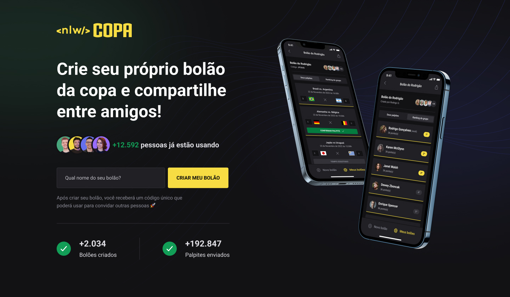

<h1 align="center"> NlW - Bolão </h1>

Promovido pela Rocketseat para ensino de tecnologias WEB.

  <a href="#-tecnologias">Tecnologias</a>&nbsp;&nbsp;&nbsp;|&nbsp;&nbsp;&nbsp;
  <a href="#-projeto">Projeto</a>&nbsp;&nbsp;&nbsp;|&nbsp;&nbsp;&nbsp;
  <a href="#-layout">Layout</a>&nbsp;&nbsp;&nbsp;|&nbsp;&nbsp;&nbsp;
  <a href="#memo-licença">Licença</a>

  

 

  

## 🚀 Tecnologias

Esse projeto foi desenvolvido com as seguintes tecnologias:

- HTML e CSS
- JavaScript
- TypeScript
- React js
- React native
- tailwind
- Next
- Expo
- Axios
- Prisma
- Node e NPM
- Git e Github

## 💻 Projeto

Uma aplicação completa, web e mobile, pra garantir a diversão da família e dos amigos durante os jogos.

## 🔖 Layout

Você pode visualizar o layout do projeto através [DESSE LINK](https://www.figma.com/file/rJwobmVdvYvqG6m9QESuuA/Bol%C3%A3o-da-Copa-(Community)?type=design&node-id=0-1&mode=design&t=hftGqpxaipoWDSVm-0). É necessário ter conta no [Figma](https://figma.com) para acessá-lo.

## :memo: Licença

Esse projeto está sob a licença MIT.

---

Feito com ♥ by Weverson Rodrigues
